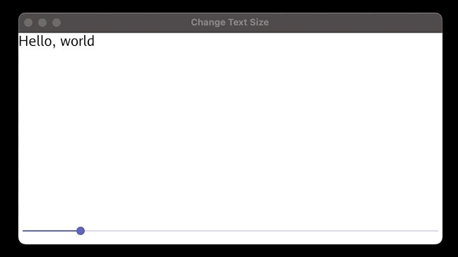
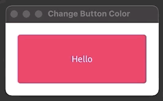

Practice [Gio](https://gioui.org/)

## changetextsize

```
mkdir my_project; cd my_project
go mod init my_project
go run github.com/zqkgo/gio-practice/changetextsize
```



## changebtncolor

```
mkdir my_project; cd my_project
go mod init my_project
go run github.com/zqkgo/gio-practice/changebtncolor
```



## listbuttons

```
mkdir my_project; cd my_project
go mod init my_project
go run github.com/zqkgo/gio-practice/listbuttons
```


## txtmirror

```
mkdir my_project; cd my_project
go mod init my_project
go run github.com/zqkgo/gio-practice/txtmirror
```


## arrowmove

```
git clone https://github.com/zqkgo/gio-practice
go run ./arrowmove
```


## colorwindow

```
git clone https://github.com/zqkgo/gio-practice
go run ./colorwindow
```


## stacksquare

```
git clone https://github.com/zqkgo/gio-practice
go run ./stacksquare
```


## multiwindow

```
git clone https://github.com/zqkgo/gio-practice
go run ./multiwindow
```

